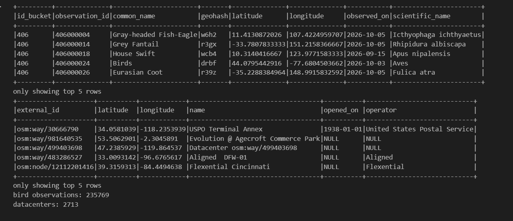
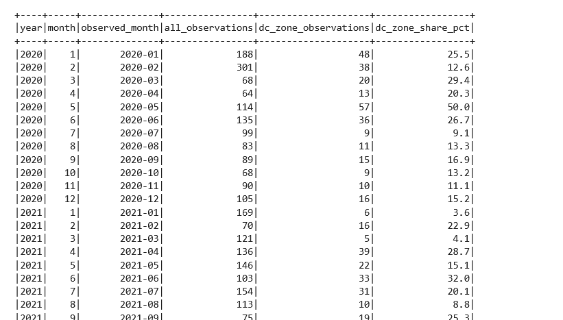
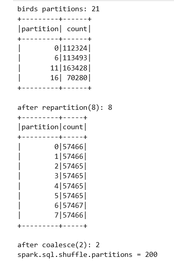
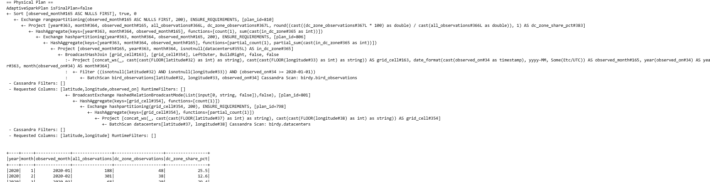
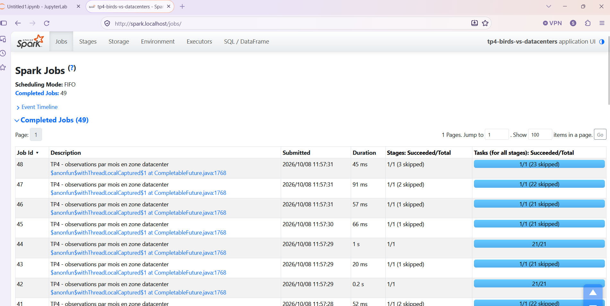
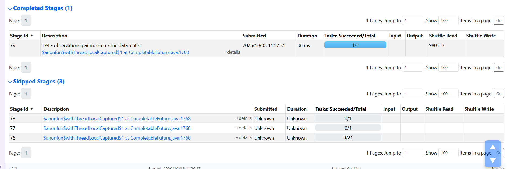

# TP4 


Notebook : [`notebook/tp4_cassandra_spark.ipynb`](notebook/tp4_cassandra_spark.ipynb)

---

## 1. Sujet

Le projet **bird-vs-datacenters** croise deux jeux de données géolocalisés :

- les **observations d'oiseaux** publiées sur iNaturalist ;
- les **datacenters** recensés dans OpenStreetMap.

L'objectif est d'étudier la cohabitation entre la biodiversité aviaire et les infrastructures numériques.

## 2. Données

| Source | Collecte | Volume (au moment du TP) |
|---|---|---|
| iNaturalist API (`taxon_id=3`, oiseaux géolocalisés) | flow Celery incrémental, par plages d'identifiants | ~230 000 observations |
| OpenStreetMap / Overpass API (`telecom=data_center`) | flow Celery, pays US, FR, BE, NL, DE, IE, GB | 2 713 datacenters |


Les deux flows tournent en continu (Celery Beat) et écrivent directement dans Cassandra. Le volume d'observations augmente donc au fil du TP.

## 3. Keyspace et tables

Keyspace : **`birdy`** (SimpleStrategy, RF = 1, nœud unique de dev)

| Table | Clé primaire | Rôle |
|---|---|---|
| `bird_observations` | `((id_bucket), observation_id)` | table principale du TP ; `id_bucket = observation_id // 1 000 000` limite la taille des partitions |
| `bird_observations_by_cell` | `((geohash), observation_id)` | mêmes observations, partitionnées par cellule geohash (précision 4, ~39 × 20 km) pour les recherches par distance |
| `datacenters` | `external_id` | sites OSM, petite table |

Colonnes utilisées dans l'analyse :

- oiseaux : `common_name`, `scientific_name`, `observed_on`, `latitude`, `longitude` ;
- datacenters : `latitude`, `longitude`, `operator`.
Capture d'écran des donnés




## 4. Question métier

> **Les zones qui contiennent des datacenters présentent-elles plus ou moins d'observations et d'espèces d'oiseaux que les autres ?**

Unité d'analyse : une cellule de 1° × 1° de latitude/longitude (`grid_cell`), commune aux deux jeux de données.

## 5. Traitements réalisés

Chaîne de traitement :

```text
Lecture Cassandra (connecteur spark-scylladb-connector 4.1.4, compatible Spark 4)
   → DataFrame Spark (bird_observations, datacenters)
   → Sélection des colonnes utiles
   → Filtres : observations géolocalisées ; observations depuis 2025 (ou 2026) ; zone Europe
   → Colonnes calculées : grid_cell, days_since_observation, observed_month
   → Agrégations : groupBy grid_cell (count, countDistinct espèces) ; groupBy grid_cell côté datacenters
   → Jointure gauche oiseaux ⟕ datacenters sur grid_cell
   → groupBy has_datacenter (count, avg, max)
   → Action show() / collect()
   → Spark UI
```

Autres manipulations :

- **Agrégations exploratoires :**
  - espèces les plus observées (nombre d'observations, nombre de cellules, âge moyen) ;
  - observations par mois.
- **Partitions :**
  - lecture de `getNumPartitions()` ;
  - répartition des lignes par partition avec `spark_partition_id()` ;
  - `repartition(8)` puis `coalesce(2)`.
- **Lazy Evaluation :**
  - quatre transformations chaînées, définies en ~0,04 s sans aucune exécution ;
  - l'action `collect()` déclenche le calcul (~1 s).
- **Plan d'exécution :** `explain(mode="formatted")`, repérage des opérateurs `Exchange`.

## 6. Principales observations

### Résultat métier  
  
*Agrégation mensuelle (`groupBy("year", "month")`) des observations depuis 2020, extrait 2020-2021.*

Pour chaque mois, le tableau donne :

- `all_observations` : le nombre total d'observations d'oiseaux dans le monde ;
- `dc_zone_observations` : le nombre d'observations situées dans une zone datacenter (cellule de 1° × 1° contenant au moins un datacenter) ;
- `dc_zone_share_pct` : la part de ces observations dans le total du mois, colonne calculée par `100 × dc_zone_observations / all_observations`.

Sur ces premières années, les effectifs sont faibles (moins de 60 observations par mois en zone datacenter), ce qui rend la part très instable : elle varie de 3,6 % (janvier 2021) à 50,0 % (mai 2020). Un indicateur en pourcentage n'est fiable qu'avec un volume suffisant ; c'est pourquoi l'analyse s'appuie ensuite sur la moyenne par mois calendaire (2020-2025) plutôt que sur un mois isolé. On distingue malgré tout déjà la saisonnalité : les mois de printemps (mai-juin 2020, avril et juin 2021) affichent les parts les plus élevées, l'été et l'hiver les plus basses.

### Partitions  



- Le DataFrame lu depuis Cassandra a **21 partitions Spark**, mais **seulement 3 contiennent des données**. Le connecteur découpe la lecture par plages de tokens, et la clé de partition `id_bucket` ne prend que 3 valeurs. **Le modèle de données Cassandra détermine directement le parallélisme (et le déséquilibre) côté Spark.**
- `repartition(8)` rééquilibre les données, au prix d'un shuffle. `coalesce(2)` réduit le nombre de partitions sans shuffle.
- `spark.sql.shuffle.partitions = 200` par défaut. L'Adaptive Query Execution (AQE) regroupe ensuite les petites partitions après le shuffle.

### Lazy Evaluation

Les transformations ne font que construire un plan. Seule une action déclenche l'exécution. Grâce à cela, l'optimiseur Catalyst peut :

- **pousser la projection** jusqu'à Cassandra : le scan ne lit que les colonnes nécessaires (`Requested Columns: [latitude, observed_on]`) ;
- **fusionner** les étapes sans shuffle dans un même stage ;
- **éviter de matérialiser** les résultats intermédiaires.

### Exécution et shuffle

- Le plan de l'analyse métier contient **4 `Exchange`** (redistributions par hachage) :
  - deux pour le `groupBy` des oiseaux (le `countDistinct` impose une agrégation en deux temps) ;
  - un pour le `groupBy` des datacenters ;
  - un pour l'agrégation finale par `has_datacenter`.
- La jointure (`SortMergeJoin`) réutilise le partitionnement par `grid_cell` déjà produit par les agrégations : **pas de shuffle supplémentaire pour la jointure**.
- Dans la Spark UI, chaque `Exchange` correspond à une frontière de stage. On y retrouve le **Shuffle Write** du stage producteur et le **Shuffle Read** du stage consommateur.


### Planification 


### Spark UI Fonctionnel 
  
  
## 8. Reproduire

```bash
make up                                                # Postgres, RabbitMQ, Cassandra (+ init du schéma)
docker compose -f compose.yaml --profile spark up -d spark
# Jupyter : http://jupyter.localhost (token : spark) — Spark UI : http://spark.localhost
```

Pour des comptages stables pendant le TP, mettre l'ingestion en pause :

```bash
docker compose stop celery-beat celery-worker
```
